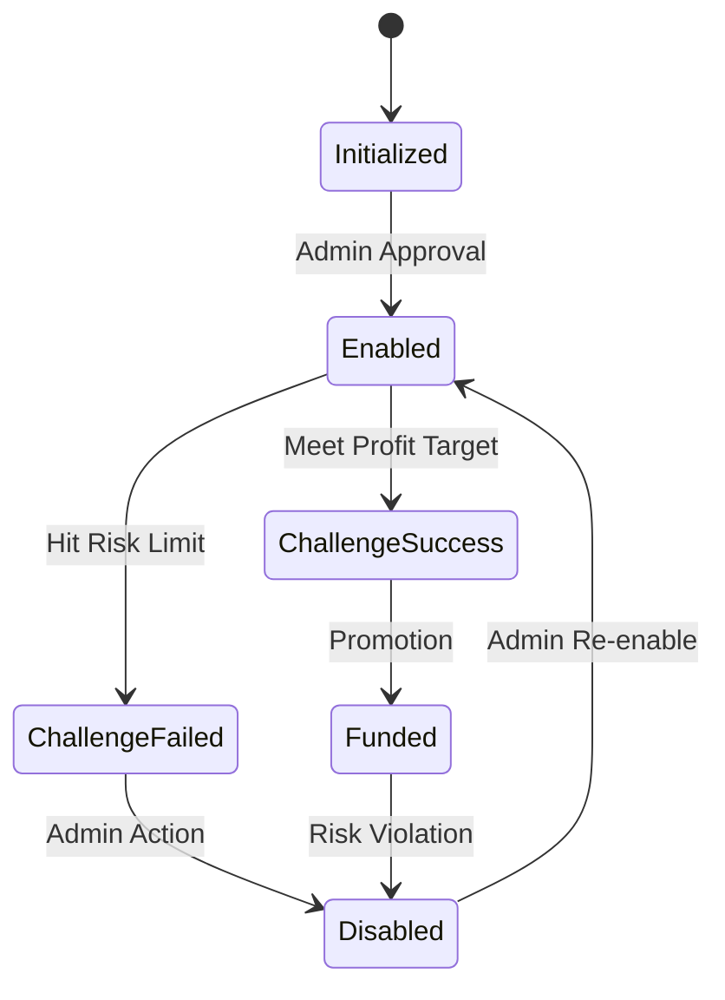

# Business Logic and User Flows

## Table of Contents
1. [User Journey and Flows](#user-journey-and-flows)
2. [Business Rules and Logic](#business-rules-and-logic)
3. [Key Features](#key-features)
4. [Security Implementation](#security-implementation)

## User Journey and Flows

### Registration and Onboarding

#### 1. User Registration (Admin-Initiated)
```mermaid
Admin → Create User Form → Volumetrica API → Local DB → Send Credentials
```

**Process**:
1. Admin accesses `/admin/users/new`
2. Fills out user creation form:
   - Personal details (name, email, phone)
   - Country selection (determines regulatory compliance)
   - Initial account preferences
3. System validates input:
   - Email uniqueness
   - Phone format
   - Country restrictions
4. Creates user in Volumetrica
5. Stores mapping in local database
6. Generates temporary password
7. Sends credentials via secure channel

**Key Considerations**:
- Users cannot self-register
- Admin approval required
- Compliance with regional regulations

### Account Creation Process

#### Step 1: User Selection
```typescript
// Admin selects existing user
const user = await prisma.user.findUnique({
  where: { volumetricaId: userId },
  include: { accounts: true }
});
```

#### Step 2: Account Configuration
- **Account Name**: Descriptive identifier
- **Initial Balance**: $25,000 - $200,000
- **Currency**: USD or EUR
- **Portfolio Mode**: Single or Multi-strategy
- **Account Type**:
  - Evaluation (Mode 0): Initial testing phase
  - Funded (Mode 2): Real capital allocation
  - Training (Mode 5): Practice environment

#### Step 3: Trading Rules Setup
- Select predefined rule set or create custom
- Configure risk parameters
- Set trading restrictions

### Trading Workflow

#### Daily Trader Activities
1. **Login**: Via Clerk authentication or Volumetrica one-time URL
2. **Dashboard Access**: Real-time account overview
3. **Performance Monitoring**:
   - Balance and P&L tracking
   - Drawdown monitoring
   - Trade analytics
4. **Risk Management**:
   - Real-time alerts for approaching limits
   - Automatic position closing on violations
5. **Reporting**: Daily/weekly performance summaries

### Admin Workflows

#### User Management
1. **Create New Users**: Complete onboarding process
2. **Monitor Activity**: Track all user actions
3. **Manage Permissions**: Enable/disable access
4. **Generate Reports**: Platform-wide analytics

#### Account Control
1. **Enable/Disable Accounts**: With reason tracking
2. **Modify Limits**: Adjust risk parameters
3. **Review Performance**: Identify top/bottom performers
4. **Compliance Checks**: Ensure regulatory adherence

## Business Rules and Logic

### Trading Rules Implementation

#### Risk Parameters

##### 1. Maximum Drawdown
```typescript
interface MaxDrawdown {
  enabled: boolean;
  percentage: number;      // e.g., 10%
  value?: number;         // e.g., $10,000
  action: RiskAction;     // DISABLE_ACCOUNT or ALERT_ONLY
  anchor: RiskAnchor;     // INITIAL_BALANCE or HIGH_WATER_MARK
}
```

**Calculation**:
```typescript
const drawdown = anchor === RiskAnchor.INITIAL_BALANCE
  ? ((initialBalance - currentBalance) / initialBalance) * 100
  : ((highWaterMark - currentBalance) / highWaterMark) * 100;
```

##### 2. Intraday Drawdown
- Resets daily at market close
- More restrictive than max drawdown
- Typically 5% for evaluation accounts

##### 3. Profit Targets (Runup)
```typescript
interface Runup {
  enabled: boolean;
  percentage: number;     // Target profit %
  action: RiskAction;     // Usually COMPLETE_CHALLENGE
}
```

##### 4. Position Controls
- **Max Position Loss**: Per-trade risk limit
- **Max Position Gain**: Prevents oversized winners
- **Max Daily Trades**: Prevents overtrading

#### Validation Logic

##### User Creation Validation
```typescript
const userSchema = z.object({
  email: z.string().email(),
  firstName: z.string().min(2).max(50),
  lastName: z.string().min(2).max(50),
  country: z.string().length(2), // ISO code
  phone: z.string().regex(/^\+?[1-9]\d{1,14}$/)
});
```

##### Account Creation Validation
1. **Balance Limits**:
   - Minimum: $25,000
   - Maximum: $200,000
   - Must be multiple of $1,000

2. **User Eligibility**:
   - Active user status
   - No existing accounts in evaluation
   - Compliance clearance

##### Trading Rule Validation
1. **Logical Consistency**:
   - Intraday limits ≤ Maximum limits
   - Position limits ≤ Portfolio limits
   - Percentage + Value alignment

2. **Risk Thresholds**:
   - Max drawdown: 5-20%
   - Intraday drawdown: 2-10%
   - Min trading days: 5-30

### Account Status Transitions



**Status Definitions**:
- **Initialized (0)**: Account created, pending activation
- **Enabled (1)**: Active trading allowed
- **ChallengeSuccess (2)**: Evaluation passed
- **ChallengeFailed (3)**: Evaluation failed
- **Disabled (10)**: Trading suspended

## Key Features

### Trader Dashboard

#### Real-Time Data Display
- **Update Frequency**: 30-second auto-refresh
- **Data Points**:
  - Current balance and equity
  - Open positions
  - Daily/Weekly/Monthly P&L
  - Drawdown metrics
  - Trade count

#### Performance Metrics
```typescript
interface PerformanceMetrics {
  winRate: number;           // Percentage of profitable trades
  averageTrade: number;      // Average P&L per trade
  profitFactor: number;      // Gross profit / Gross loss
  bestDay: DailyResult;
  worstDay: DailyResult;
  totalTrades: number;
}
```

#### Visual Components
1. **Account Overview Card**: Balance, status, key metrics
2. **Performance Chart**: 30-day balance history
3. **Drawdown Progress**: Visual risk indicators
4. **Trading Rules Display**: Current limits and progress

### Admin Dashboard

#### Platform Statistics
```typescript
interface PlatformStats {
  totalUsers: number;
  activeAccounts: number;
  totalBalance: Decimal;
  dailyVolume: Decimal;
  topPerformers: User[];
  riskAlerts: Alert[];
}
```

#### Management Tables
1. **Users Table**:
   - Sortable/filterable columns
   - Bulk actions
   - Quick access to user details

2. **Accounts Table**:
   - Real-time status updates
   - Performance indicators
   - Enable/disable controls

3. **Audit Log**:
   - All system actions
   - Filterable by user/action/date
   - Export capabilities

### Account Management

#### Account Types

##### Evaluation Accounts
- **Purpose**: Test trader skills
- **Capital**: Simulated funds
- **Duration**: 30-90 days
- **Success Criteria**: Meet profit target without violations

##### Funded Accounts
- **Purpose**: Real capital trading
- **Capital**: Firm's money
- **Profit Split**: Typically 80/20 (trader/firm)
- **Withdrawal**: Monthly profit withdrawals

##### Training Accounts
- **Purpose**: Practice and learning
- **Capital**: Demo funds
- **Features**: Full platform access, no real risk

#### Lifecycle Management
1. **Creation**: Admin-initiated with full configuration
2. **Monitoring**: Automated risk checks every trade
3. **Evaluation**: Performance review at milestones
4. **Promotion/Demotion**: Based on performance
5. **Termination**: On serious violations or inactivity

## Security Implementation

### Authentication

#### Multi-Layer Authentication
1. **Primary**: Clerk authentication
   - Email/password or SSO
   - Session management
   - MFA support

2. **Secondary**: Volumetrica one-time URLs
   - Generated per session
   - 15-minute expiration
   - Single use only

3. **API Authentication**:
   ```typescript
   // Middleware protection
   export async function requireAuth() {
     const { userId } = auth();
     if (!userId) throw new Error('Unauthorized');
     return userId;
   }
   ```

### Authorization

#### Role-Based Access Control

##### Trader Permissions
- View own accounts only
- Read-only access to rules
- Cannot modify account settings
- No access to admin functions

##### Admin Permissions
- Full user management
- Account creation/modification
- Trading rule configuration
- Platform-wide visibility
- Audit log access

#### Resource-Level Security
```typescript
// Verify resource ownership
const account = await prisma.account.findFirst({
  where: {
    accountId: requestedAccountId,
    user: { clerkId: currentUserId }
  }
});
if (!account) throw new Error('Forbidden');
```

### Data Protection

#### Encryption
1. **In Transit**:
   - HTTPS everywhere
   - TLS 1.3 minimum
   - Certificate pinning for API calls

2. **At Rest**:
   - Database encryption
   - Encrypted backups
   - Secure credential storage

#### Input Validation
1. **Zod Schemas**: Runtime validation
2. **SQL Injection Prevention**: Parameterized queries via Prisma
3. **XSS Prevention**: React's automatic escaping
4. **CSRF Protection**: Next.js built-in

### API Security

#### Rate Limiting
```typescript
const rateLimiter = new Ratelimit({
  redis,
  limiter: Ratelimit.slidingWindow(10, "10 s"),
  prefix: "api",
});

// Applied to all API routes
const identifier = userId || ip;
const { success } = await rateLimiter.limit(identifier);
if (!success) {
  return new Response("Too Many Requests", { status: 429 });
}
```

#### Request Validation
1. **Schema Validation**: Every endpoint
2. **Authentication Check**: Before processing
3. **Authorization Verification**: Resource access
4. **Input Sanitization**: Prevent injection

#### Audit Trail
```typescript
await prisma.auditLog.create({
  data: {
    userId,
    action: 'ACCOUNT_CREATED',
    entityType: 'Account',
    entityId: account.id,
    metadata: { /* relevant data */ },
    ipAddress: request.ip,
    userAgent: request.headers['user-agent']
  }
});
```

**Tracked Actions**:
- User creation/modification
- Account operations
- Trading rule changes
- Login attempts
- API access
- Configuration changes