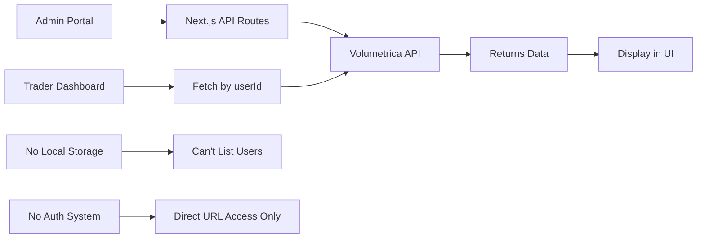
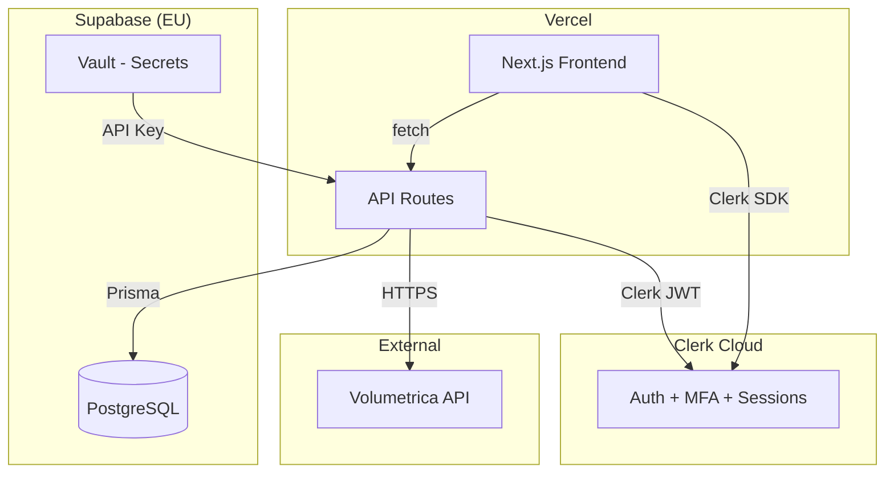

# Post-Prototype Roadmap - Final Implementation Plan

**Last Updated**: July 27, 2025  
**Purpose**: Definitive, locked-in plan for production implementation with Clerk + Supabase + Next.js

## 🔒 Final Technology Decisions (No Changes)

| Component | Decision | Rationale |
|-----------|----------|-----------|
| **Architecture** | Monolithic Next.js 15 App Router | One deployment, shared types, simple |
| **Database** | Supabase PostgreSQL (EU region) | RLS, free tier, easy migration |
| **ORM** | Prisma | Type-safe, great DX |
| **Authentication** | Clerk | Free for 3K MAU, handles all auth UI/flows |
| **Backend** | Next.js API Routes | No separate backend needed |
| **Trading API** | Volumetrica (existing client) | Already integrated |
| **Deployment** | Vercel | Perfect for Next.js |
| **Monitoring** | Sentry + Vercel Analytics | Errors + performance |
| **Data Sync** | Pull-based 5-min cron | Simple, reliable |

**Note on regions**: Starting with EU for Supabase, but will need multi-region strategy for global traders (India, Canada, US, Europe)

## 📚 Current Codebase Overview

### Project Structure
```
crypto-vol-integration/
├── src/
│   ├── app/                      # Next.js 15 App Router
│   │   ├── api/                  # API Routes
│   │   │   ├── accounts/         # Account management endpoints
│   │   │   │   ├── create/       # POST - Create trading account
│   │   │   │   └── list/         # GET - List accounts (currently broken)
│   │   │   ├── trading-rules/    # Trading rule endpoints
│   │   │   │   ├── create/       # POST - Create custom rule
│   │   │   │   ├── list/         # GET - List rules
│   │   │   │   ├── templates/    # GET - Pre-configured templates
│   │   │   │   └── [ruleId]/     # GET/PUT/DELETE - Rule operations
│   │   │   └── users/            # User management
│   │   │       ├── create/       # POST - Create user
│   │   │       └── login-url/    # POST - Get Volumetrica login URL
│   │   ├── admin/                # Admin dashboard page
│   │   ├── trader/               
│   │   │   └── [userId]/         # Dynamic trader dashboard
│   │   └── page.tsx              # Landing page
│   ├── components/
│   │   ├── admin/                # Admin UI components
│   │   │   ├── AccountCreationForm.tsx  # Multi-step form
│   │   │   ├── AccountsTable.tsx        # Account listing
│   │   │   ├── TradingRulesManager.tsx  # Rule CRUD UI
│   │   │   └── UserManagement.tsx       # User operations
│   │   ├── trader/               # Trader dashboard components
│   │   │   ├── AccountOverviewCard.tsx  # Balance/status display
│   │   │   ├── PerformanceMetrics.tsx   # Charts and metrics
│   │   │   ├── TradingRulesDisplay.tsx  # Active rules view
│   │   │   └── DrawdownProgress.tsx     # Risk monitoring
│   │   └── ui/                   # shadcn/ui components
│   ├── lib/
│   │   ├── volumetrica/          # Volumetrica integration
│   │   │   ├── client.ts         # API client with retry logic
│   │   │   └── client-logger.ts  # Request/response logging
│   │   ├── data/                 # Static data
│   │   │   ├── countries.ts      # ISO country codes
│   │   │   └── us-states.ts      # US state codes
│   │   └── utils.ts              # Utility functions
│   ├── types/
│   │   └── volumetrica.ts        # TypeScript definitions
│   └── hooks/                    # React hooks
│       └── use-users.ts          # User data fetching
├── volumetrica/                  # Documentation
│   ├── API_ENDPOINTS_GUIDE.md    # API reference
│   └── platform.md               # Platform overview
└── rules-docs-agents/            # Project documentation
```

### Current Implementation Details

#### 1. **Volumetrica Integration Approach**
```typescript
// lib/volumetrica/client.ts
class VolumetricaClient {
  - Base URL: https://staging-api.volumetricafx.com
  - Auth: Header-based API key (x-api-key)
  - Retry logic: 3 attempts with exponential backoff
  - Error handling: Custom VolumetricaError class
  - Logging: All requests/responses logged
}

// Current API usage pattern:
volumetricaApi.users.create()      // Create user
volumetricaApi.accounts.create()   // Create trading account
volumetricaApi.tradingRules.list() // List trading rules
```

#### 2. **Data Flow (Current State)**


#### 3. **Key Limitations Discovered**
- **No User Management**: Volumetrica provides NO endpoints for:
  - GET /user/{userId} - Can't fetch user profiles
  - GET /users - Can't list users
  - PUT /user/{userId} - Can't update users
  - DELETE /user/{userId} - Can't delete users
  
- **Limited Account Listing**: 
  - GET /tradingAccount returns 404 when no accounts exist
  - Must use GET /api/Propsite/GetUserAccounts?userId={userId}
  
- **No Authentication**: 
  - Volumetrica returns username/password but no login endpoint
  - Expected to build our own auth system

#### 4. **Current Working Features**
✅ **User Creation**
- Creates user in Volumetrica
- Returns: userId, username, password
- Fixed validation issues with country/state codes

✅ **Account Creation**
- Creates trading account with custom rules
- Associates with userId
- Returns accountId and initial status

✅ **Trading Rule Templates**
- Pre-configured templates (hardcoded)
- Custom rule creation
- Rule management UI

✅ **Trader Dashboard**
- Displays account data (when accessed directly)
- Mock performance metrics
- Real-time balance display
- Risk parameter visualization

#### 5. **Current Non-Working Features**
❌ **User Listing** - No way to fetch users from Volumetrica
❌ **Account Listing** - 404 errors, wrong endpoint used
❌ **Authentication** - No login system
❌ **User Search** - No data to search
❌ **Multi-Account View** - Can't list user's accounts
❌ **Data Persistence** - Everything ephemeral

### Volumetrica API Integration Philosophy

Based on documentation analysis, Volumetrica expects:
1. **Prop firms maintain their own user database**
   - Store user profiles locally
   - Only use Volumetrica for trading operations
   - Map local users to Volumetrica userId

2. **Limited to trading operations**
   - Account creation/management
   - Balance and P&L tracking
   - Trading rule enforcement
   - Order/position management

3. **Real-time data via**
   - REST API polling
   - WebSocket (for trading platforms)
   - Webhooks (on request)

### Current Tech Stack
- **Frontend**: Next.js 15, TypeScript, Tailwind CSS
- **UI Components**: shadcn/ui, Radix UI
- **State Management**: React Query (TanStack Query)
- **Forms**: React Hook Form + Zod validation
- **API Communication**: Native fetch with custom client
- **Deployment Target**: Vercel
- **Environment**: Staging (Volumetrica staging API)

## 🔍 Critical Analysis for Second Opinion

### Architecture Decision Points

#### 1. **Architecture Approach**
**Decision**: Monolithic Next.js app with API routes
**Benefits**: 
- Simple deployment on Vercel
- Shared types/validation
- Easy development
- Lower operational overhead
**Future**: Consider microservices only after 10k+ users

#### 2. **Database Decision**
**Selected**: PostgreSQL via Supabase (EU region)
**Benefits**:
  - Row Level Security (RLS)
  - Realtime subscriptions
  - Generous free tier
  - Built-in backups
  - Easy migration to self-hosted if needed
**Multi-region strategy**: Consider read replicas for India/Canada/US in Phase 5+

#### 3. **Authentication Strategy**
**Challenge**: Volumetrica provides credentials but no auth endpoint
**Solution**: Clerk authentication with Volumetrica mapping
- Store Volumetrica userId mapping in Supabase
- Use Clerk for all auth flows (login, MFA, password reset)
- Never store Volumetrica passwords
- Generate one-time SSO links for trading platform access

#### 4. **Data Synchronization**
**Problem**: Need to keep local cache in sync with Volumetrica
**Approaches**:
1. **Pull-based** (Recommended):
   - On-demand sync when user accesses
   - Background cron every 5 minutes
   - Pros: Simple, reliable
   - Cons: Potential staleness

2. **Push-based**:
   - Webhooks from Volumetrica
   - Pros: Real-time updates
   - Cons: Requires webhook setup, complexity

3. **Hybrid**:
   - Webhooks for critical events
   - Polling for everything else
   - Pros: Best of both
   - Cons: Most complex

### Security Considerations

1. **API Key Management**
   - Currently in .env file ✓
   - Need rotation strategy
   - Consider per-environment keys

2. **User Data Protection**
   - Hash passwords before storage
   - Encrypt sensitive data at rest
   - Use HTTPS everywhere
   - Implement rate limiting

3. **Access Control**
   - Traders see only their accounts
   - Admins have full access
   - API routes need auth middleware
   - Consider IP whitelisting for admin

### Scalability Analysis

**Current Limitations**:
- No caching layer
- Direct API calls on every request
- No connection pooling
- Single region deployment

**Proposed Improvements**:
1. Add Redis for caching
2. Implement connection pooling
3. Use CDN for static assets
4. Consider multi-region deployment

### Cost Projections

**Monthly Costs by User Count**:
```
100 users:   ~$25/month  (Free tiers)
1K users:    ~$81/month  (Pro tiers)
10K users:   ~$200/month (Scale up)
100K users:  ~$1000/month (Enterprise)
```

**Main Cost Drivers**:
- Database storage
- API request volume
- Bandwidth usage
- Background job compute

### Risk Assessment

**High Risk**:
- No data backup strategy
- Single point of failure (Volumetrica API)
- No disaster recovery plan

**Medium Risk**:
- Performance under load unknown
- No monitoring/alerting
- Manual deployment process

**Low Risk**:
- Technology choices are solid
- Code structure is clean
- Type safety with TypeScript

## 🎯 Recommended Implementation Order

### Phase 1: Foundation (Week 1)
1. Set up Supabase project
2. Create database schema
3. Implement authentication
4. Add session management
5. Create login/logout flow

### Phase 2: Data Layer (Week 2)
1. Build user CRUD operations
2. Implement account sync logic
3. Add caching strategy
4. Create audit logging
5. Set up background jobs

### Phase 3: User Experience (Week 3-4)
1. Update trader dashboard with auth
2. Build admin user management
3. Add multi-account support
4. Implement real-time updates
5. Create reporting features

### Phase 4: Production Ready (Week 5-6)
1. Add monitoring and alerts
2. Implement backup strategy
3. Performance optimization
4. Security audit
5. Documentation

## ❓ Questions for Stakeholders

1. **Business Requirements**
   - Expected number of users?
   - Growth projections?
   - Compliance requirements?
   - SLA expectations?

2. **Technical Constraints**
   - Budget limitations?
   - Team size and expertise?
   - Timeline flexibility?
   - Integration requirements?

3. **Feature Priorities**
   - Must-have vs nice-to-have?
   - Mobile app plans?
   - API for third parties?
   - White-label requirements?

## 🚨 Alternative Approaches to Consider

### 1. **BaaS Alternative: Firebase**
Instead of Supabase:
- Pros: Better real-time, easier setup
- Cons: Vendor lock-in, less SQL-friendly

### 2. **Separate Backend**
Instead of Next.js API routes:
- Node.js + Express
- Pros: Better separation, easier scaling
- Cons: More complexity, deployment overhead

### 3. **Alternative Database**
Instead of Supabase:
- Self-hosted PostgreSQL on AWS RDS
- Pros: More control, potentially cheaper at scale
- Cons: More maintenance, no built-in RLS

### 4. **GraphQL Instead of REST**
- Pros: Better data fetching, type safety
- Cons: Learning curve, overkill for this project

## 📊 Database Schema v1.0

```prisma
// schema.prisma - Single source of truth
model User {
  id               String   @id @default(uuid())
  clerkId          String   @unique // Clerk user ID
  volumetricaId    String   @unique // Volumetrica user ID
  email            String   @unique
  firstName        String
  lastName         String
  country          String   @db.Char(2)
  state            String?  @db.Char(2)
  phone            String?
  createdAt        DateTime @default(now())
  accounts         Account[]
  auditLogs        AuditLog[]
}

model Account {
  accountId        String   @id // Volumetrica account ID
  userId           String
  balance          Decimal  @db.Decimal(18,2) // NUMERIC in PostgreSQL
  currency         String   @db.Char(3)
  status           Int
  lastSequence     String?  // For idempotency
  lastSync         DateTime
  createdAt        DateTime @default(now())
  user             User     @relation(fields: [userId], references: [id], onDelete: Cascade)
}

model AuditLog {
  id          String   @id @default(uuid())
  userId      String?
  action      String
  details     Json
  ipAddress   String?
  createdAt   DateTime @default(now())
  user        User?    @relation(fields: [userId], references: [id])
}
```

## 🏭 Target Architecture



## 🚀 Phase 0: Environment Setup (Days 1-2)

### Day 1: Infrastructure
- [ ] Create Supabase project (EU region)
- [ ] Create Clerk development instance
- [ ] Create Vercel project
- [ ] Set up GitHub repository
- [ ] Configure environment variables:
  ```env
  # .env.local
  NEXT_PUBLIC_CLERK_PUBLISHABLE_KEY=pk_test_...
  CLERK_SECRET_KEY=sk_test_...
  DATABASE_URL=postgresql://...
  DIRECT_URL=postgresql://... # For migrations
  VOLUMETRICA_API_KEY=...
  VOLUMETRICA_API_URL=https://staging-api.volumetricafx.com
  ```

### Day 2: Database & Auth
- [ ] Initialize Prisma: `npx prisma init`
- [ ] Create schema.prisma with models above
- [ ] Run migrations: `npx prisma migrate dev`
- [ ] Install Clerk SDK: `npm install @clerk/nextjs`
- [ ] Configure Clerk middleware
- [ ] Set up RLS policies:
  ```sql
  -- Traders see only their data
  CREATE POLICY "Users can read own data" ON users
    FOR SELECT USING (id = current_user_id());
  
  -- Admins bypass all policies
  CREATE POLICY "Admins have full access" ON users
    FOR ALL USING (current_user_role() = 'admin');
  ```

## 🔄 Phase 2: Sync & Observability (Weeks 2-3)

### Week 2: Data Sync
- [ ] Implement 5-min cron job:
  ```typescript
  // api/cron/sync-accounts/route.ts
  export async function GET(req: Request) {
    // Verify cron secret
    if (req.headers.get('authorization') !== `Bearer ${process.env.CRON_SECRET}`) {
      return new Response('Unauthorized', { status: 401 });
    }
    
    // Sync active users only
    const activeUsers = await prisma.user.findMany({
      where: {
        accounts: { some: { lastSync: { lt: new Date(Date.now() - 5 * 60 * 1000) } } }
      }
    });
    
    for (const user of activeUsers) {
      await syncUserAccounts(user.volumetricaId);
    }
  }
  ```
- [ ] Configure Vercel cron:
  ```json
  // vercel.json
  {
    "crons": [{
      "path": "/api/cron/sync-accounts",
      "schedule": "*/5 * * * *"
    }]
  }
  ```

### Week 3: Monitoring & Audit
- [ ] Integrate Sentry
- [ ] Add health check endpoint:
  ```typescript
  // api/health/route.ts
  export async function GET() {
    const checks = {
      database: await checkDatabase(),
      volumetrica: await checkVolumetrica(),
      timestamp: new Date().toISOString()
    };
    return Response.json(checks);
  }
  ```
- [ ] Implement audit logging:
  ```typescript
  // Prisma middleware for automatic audit logs
  prisma.$use(async (params, next) => {
    if (['create', 'update', 'delete'].includes(params.action)) {
      await prisma.auditLog.create({
        data: {
          action: `${params.model}.${params.action}`,
          details: params.args,
          userId: getCurrentUserId(),
          ipAddress: getClientIp()
        }
      });
    }
    return next(params);
  });
  ```

## 🚀 Phase 1: Core Authentication & CRUD (Week 1)

### Day 3: Clerk Integration
- [ ] Set up Clerk middleware:
  ```typescript
  // middleware.ts
  import { authMiddleware } from "@clerk/nextjs";
  
  export default authMiddleware({
    publicRoutes: ["/", "/api/webhooks/clerk"],
    ignoredRoutes: ["/api/health"]
  });
  ```
- [ ] Create auth utilities:
  ```typescript
  // lib/auth.ts
  export async function requireAuth() {
    const { userId } = auth();
    if (!userId) redirect('/sign-in');
    return userId;
  }
  ```

### Day 4: Admin User Creation
- [ ] Admin creates trader flow:
  ```typescript
  // api/admin/users/create/route.ts
  async function POST(req: Request) {
    // 1. Create user in Clerk (via API)
    const clerkUser = await clerk.users.createUser({
      emailAddress: email,
      password: generateTempPassword(),
    });
    
    // 2. Create user in Volumetrica
    const volUser = await volumetricaApi.users.create({
      email, firstName, lastName, country
    });
    
    // 3. Store mapping in Supabase
    await prisma.user.create({
      data: {
        clerkId: clerkUser.id,
        volumetricaId: volUser.userId,
        email, firstName, lastName, country, state
      }
    });
  }
  ```

### Day 5: Trader Dashboard
- [ ] Protected dashboard route
- [ ] Account fetching with cache:
  ```typescript
  // api/accounts/route.ts
  async function GET() {
    const user = await getCurrentUser(); // via Clerk
    
    // Check cache freshness
    const cached = await prisma.account.findMany({
      where: { userId: user.id },
    });
    
    const needsSync = cached.some(
      acc => Date.now() - acc.lastSync > 5 * 60 * 1000
    );
    
    if (needsSync) {
      const fresh = await volumetricaApi.getUserAccounts(user.volumetricaId);
      // Upsert with idempotency check
      await syncAccounts(fresh);
    }
    
    return cached;
  }
  ```

## 🏗️ Production Architecture (3-6 months)

## 💸 Phase 3: Production Hardening (Weeks 4-5)

### Week 4: Security & Performance
- [ ] Enable Clerk MFA for funded accounts
- [ ] Add rate limiting:
  ```typescript
  // lib/rate-limit.ts
  const limiter = new Ratelimit({
    redis: Redis.fromEnv(),
    limiter: Ratelimit.slidingWindow(10, "10 s"),
  });
  ```
- [ ] Implement GDPR endpoints:
  ```typescript
  // api/me/export/route.ts - Export user data
  // api/me/delete/route.ts - Soft delete with 30-day purge
  ```
- [ ] Load test with k6 (250 concurrent users)

### Week 5: Production Deployment
- [ ] Switch to Volumetrica production API
- [ ] Configure Clerk production instance
- [ ] Set up custom domain (auth.yourdomain.com)
- [ ] Document backup/restore procedures
- [ ] Create runbooks for common issues

## 🚀 Phase 4: Enhanced Features (Month 2-3)

### Admin Enhancements
- User search and filtering
- Bulk operations
- Export user/account data
- Activity dashboard
- Support ticket integration

### Trader Enhancements
- Performance charts (using Recharts)
- Multi-account aggregation
- PDF statement generation
- Email notifications for:
  - Account status changes
  - Challenge completion/failure
  - Daily P&L summaries

### Technical Improvements
- Add Redis caching (if latency > 500ms)
- Implement Volumetrica webhooks (if available)
- Add comprehensive error boundaries
- Improve loading states with skeletons

## ⚠️ Critical Implementation Guidelines

### 1. Authentication Flow
```typescript
// User Creation:
1. Admin creates via Clerk API (not UI)
2. Clerk handles password/email verification
3. Store Clerk <-> Volumetrica mapping
4. Never store Volumetrica passwords

// Platform Access:
if (userNeedsTradingPlatform) {
  const { loginUrl } = await volumetricaApi.generateLoginUrl(userId);
  window.open(loginUrl, '_blank'); // One-time SSO
}
```

### 2. Money & Multi-Currency
```typescript
// Storage: Decimal type in Prisma (NUMERIC in DB)
// Math: Use decimal.js for calculations
// Display: Intl.NumberFormat for locale formatting
// Aggregation: Defer until Phase 4 (complex with FX rates)
```

### 3. Idempotency & Sync
```typescript
// Every Volumetrica response includes sequenceId
// Only update if newer than lastSequence
if (response.sequenceId > account.lastSequence) {
  await prisma.account.update({
    where: { accountId },
    data: { 
      ...response,
      lastSequence: response.sequenceId,
      lastSync: new Date()
    }
  });
}
```

### 4. Global Latency Considerations
```yaml
Current: Supabase EU region
Future considerations for India/Canada/US traders:
  - Edge functions on Vercel (automatic)
  - Consider read replicas in Phase 5
  - Cache aggressively (5-min staleness OK)
  - CDN for all static assets
```

## 💰 Budget & Scaling

### Current Costs (1000 traders)
```yaml
Monthly:
  Vercel Pro: $20
  Supabase Free: $0 (under 500MB)
  Clerk Free: $0 (under 3K MAU)
  Sentry Free: $0 (under 5K events)
  Total: $20/month
```

### Scaling Thresholds
```yaml
3K traders:
  Supabase Pro: $25/month
  Total: $45/month

10K traders:
  Clerk Pro: $250/month
  Supabase Pro: $25/month
  Vercel Pro: $20/month
  Total: $295/month
```

#### 3. Monitoring & Alerts
- Error tracking (Sentry)
- Performance monitoring
- Uptime monitoring
- Admin notifications for failures

## 📅 Timeline Summary

### With 2 Developers
```
Phase 0 (Setup):        2 days
Phase 1 (Auth & CRUD):  1 week  
Phase 2 (Sync & Audit): 2 weeks
Phase 3 (Hardening):    2 weeks
Phase 4 (Enhancements): 4 weeks

Total to Production: 6 weeks
Total to Full Features: 10 weeks
```

### Success Milestones
- Week 1: Admin can create users, traders can login
- Week 3: Full sync working, audit logs active
- Week 5: Production-ready with MFA
- Week 10: All enhanced features live

## 🔒 Security Considerations

### Must-Have Security
1. **API Key Rotation**
   - Store Volumetrica API key securely
   - Implement key rotation mechanism

2. **Rate Limiting**
   - Protect API routes
   - Prevent Volumetrica API abuse

3. **Data Encryption**
   - Encrypt sensitive user data
   - Secure password storage (even temporary ones)

4. **Audit Logging**
   - Track all admin actions
   - Monitor account creation/modification

## 🎁 What's NOT in Scope (Explicitly Deferred)

### Phase 5+ (Future)
- WebSocket real-time updates
- Mobile applications
- Advanced RBAC (just admin/trader for now)
- KYC/AML integration
- Payment Integration (Authorize.net) - for account funding, subscription fees, and performance payouts
- White-label support
- Partner API
- Advanced compliance (SOC2, etc)
- Multi-tenant isolation
- Microservices refactor

## 🎁 Open Questions for Stakeholders

1. **Volumetrica SLA**: What's our fallback if their API is down?
2. **Admin Roles**: Just admin + trader, or need support tier?
3. **Data Residency**: EU okay for India/US/Canada traders?
4. **Email Service**: Clerk's built-in or separate provider?
5. **Custom Domain**: What domain for auth.yourdomain.com?

## 🎯 Success Metrics

Track these KPIs:
- User creation success rate
- Account creation time
- API response times
- Error rates
- User satisfaction

## ✅ Next Action: Green Light to Start

### What We Need
1. Volumetrica production API credentials
2. Domain name decision
3. Approval on EU data residency
4. GitHub repository access
5. Clerk/Supabase account creation

### Day 1 Deliverables
- Development environment running
- Database schema deployed
- Basic auth flow working
- CI/CD pipeline active

### Week 1 Demo
- Admin creates trader
- Trader logs in via Clerk
- Dashboard shows live Volumetrica data
- Audit logs capturing all actions

**Ready to execute this plan? Let's start Phase 0 immediately.**

## 📝 Key Technical Decisions (Locked In)

### Database: Supabase PostgreSQL (EU Region)
- Built-in RLS for security
- Generous free tier
- Easy migration path
- Type safety with Prisma ORM

### Authentication: Clerk
- Handles all auth flows
- Free for 3K MAU
- Built-in MFA support
- Seamless integration with Next.js

### Architecture: Monolithic Next.js
- Single deployment
- Shared types
- Easier to maintain
- Scale vertically until 10K+ users

