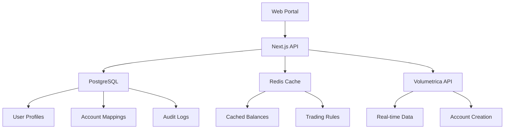

# Post-Prototype Roadmap

**Last Updated**: July 26, 2025  
**Purpose**: Clear path from prototype to production based on Volumetrica API limitations

## 🚀 Immediate Next Steps (1-2 weeks)

### 1. Add Local User Storage
Since Volumetrica doesn't provide user profile fetching, implement a simple solution:

#### Option A: Browser Storage (Quick Fix)
```typescript
// utils/userStorage.ts
export const userStorage = {
  saveUser: (userId: string, userData: any) => {
    localStorage.setItem(`user_${userId}`, JSON.stringify(userData));
  },
  getUser: (userId: string) => {
    const data = localStorage.getItem(`user_${userId}`);
    return data ? JSON.parse(data) : null;
  }
};
```

#### Option B: SQLite Database (Better)
```typescript
// Use Prisma with SQLite for quick local storage
// prisma/schema.prisma
model User {
  id            String   @id @default(cuid())
  volumetricaId String   @unique
  email         String   @unique
  firstName     String
  lastName      String
  country       String
  createdAt     DateTime @default(now())
}
```

### 2. Deploy to Vercel
- Current code is ready for deployment
- Add environment variables in Vercel dashboard
- Test with staging Volumetrica API

### 3. Add Basic Authentication
- Use NextAuth.js with credentials provider
- Simple admin login (no Volumetrica integration needed)
- Protect admin routes

## 📋 MVP Requirements (1 month)

### Phase 1: Data Persistence
**Problem**: No way to fetch user profiles from Volumetrica  
**Solution**: Implement proper database

```typescript
// Recommended stack
- Database: PostgreSQL (Supabase or Neon)
- ORM: Prisma
- Schema: Users, Accounts (cache), AuditLogs
```

### Phase 2: User Management System
```typescript
// Features to build
- User profile CRUD
- Search by email/name
- User activity tracking
- Account association mapping
```

### Phase 3: Enhanced Admin Features
- Bulk user creation
- CSV import/export
- User filtering and sorting
- Admin activity logs

## 🏗️ Production Architecture (3-6 months)

### Recommended Tech Stack
```yaml
Frontend:
  - Next.js 15 (current)
  - Tailwind + shadcn/ui (current)
  - React Query (current)
  
Backend:
  - Next.js API Routes → Consider separate backend
  - PostgreSQL for user data
  - Redis for caching Volumetrica responses
  
Authentication:
  - NextAuth.js with multiple providers
  - Role-based access control
  - API key management for traders
  
Infrastructure:
  - Vercel for frontend
  - Supabase/Neon for database
  - Upstash Redis for caching
  - Resend for emails
```

### Data Flow Architecture


### Critical Features to Add

#### 1. Webhook Handler
```typescript
// api/webhooks/volumetrica/route.ts
- Account status changes
- Balance updates
- Challenge failures
- Store events in database
```

#### 2. Background Jobs
```typescript
// Using Vercel Cron or Quirrel
- Sync account data every 5 minutes
- Generate daily reports
- Clean up expired sessions
- Send email notifications
```

#### 3. Monitoring & Alerts
- Error tracking (Sentry)
- Performance monitoring
- Uptime monitoring
- Admin notifications for failures

## 💰 Cost Optimization

### Current Costs (Prototype)
- Vercel: Free tier
- Volumetrica: API calls only

### Projected Costs (Production)
```
Monthly estimates for 1000 traders:
- Vercel Pro: $20
- Database (Supabase): $25
- Redis (Upstash): $10
- Monitoring: $20
- Total: ~$75/month
```

## 🔒 Security Considerations

### Must-Have Security
1. **API Key Rotation**
   - Store Volumetrica API key securely
   - Implement key rotation mechanism

2. **Rate Limiting**
   - Protect API routes
   - Prevent Volumetrica API abuse

3. **Data Encryption**
   - Encrypt sensitive user data
   - Secure password storage (even temporary ones)

4. **Audit Logging**
   - Track all admin actions
   - Monitor account creation/modification

## 📊 Migration Strategy

### From Prototype to Production

#### Step 1: Database Setup (Week 1)
```sql
-- Essential tables
CREATE TABLE users (
  id UUID PRIMARY KEY,
  volumetrica_id VARCHAR UNIQUE,
  email VARCHAR UNIQUE,
  first_name VARCHAR,
  last_name VARCHAR,
  created_at TIMESTAMP
);

CREATE TABLE account_cache (
  account_id VARCHAR PRIMARY KEY,
  user_id UUID REFERENCES users(id),
  data JSONB,
  updated_at TIMESTAMP
);
```

#### Step 2: Data Migration (Week 2)
- Export any existing users from Volumetrica
- Import into local database
- Set up sync mechanisms

#### Step 3: Gradual Feature Release (Week 3-4)
- Deploy with feature flags
- Test with small group
- Monitor performance
- Full rollout

## 🎯 Success Metrics

Track these KPIs:
- User creation success rate
- Account creation time
- API response times
- Error rates
- User satisfaction

## 🚨 Known Limitations to Address

1. **No User Profile Updates**
   - Build complete user management system
   - Only use Volumetrica for trading data

2. **No User Search in Volumetrica**
   - Implement robust search in your database
   - Cache and index user data

3. **Limited Bulk Operations**
   - Build bulk import/export features
   - Queue system for large operations

## 📝 Decision Points

### Immediate Decision Required:
**Q: How to handle user data storage?**

**Recommendation**: Start with SQLite + Prisma for MVP, migrate to PostgreSQL for production. This gives you:
- Quick setup
- Easy development
- Clear migration path
- Type safety with Prisma

### Architecture Decision:
**Q: Monolith or Microservices?**

**Recommendation**: Stay monolithic until 10,000+ users. Next.js can handle it, and it's easier to maintain.

## 🎉 You're Ready!

The prototype proves the concept works. With these enhancements, you'll have a production-ready platform that:
- ✅ Works around Volumetrica's limitations
- ✅ Provides excellent user experience
- ✅ Scales with your business
- ✅ Maintains data integrity
- ✅ Meets security requirements

**Next Action**: Deploy to Vercel and start gathering user feedback!